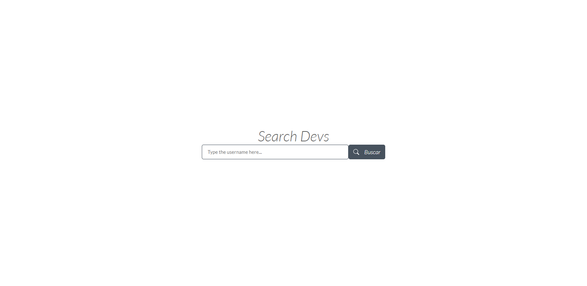
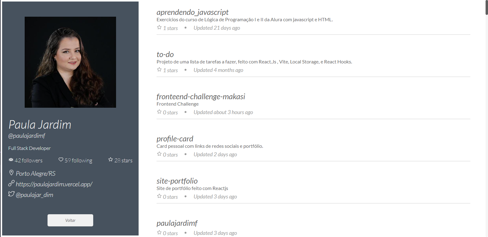
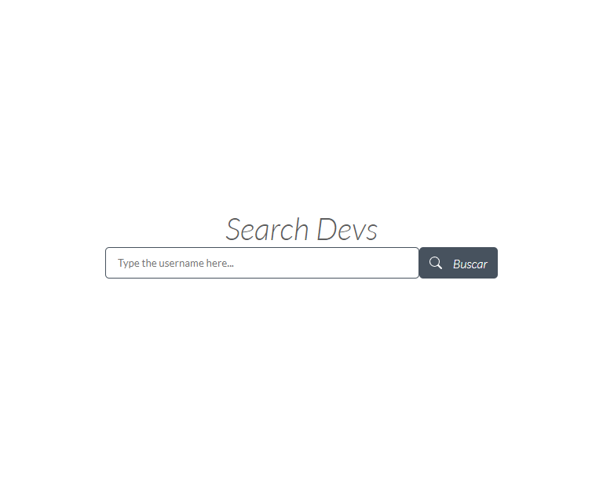
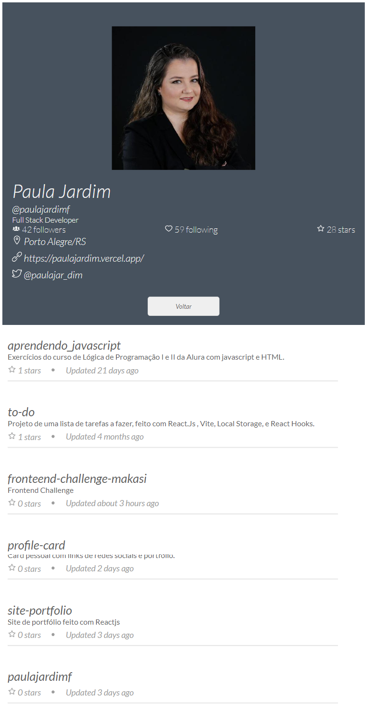
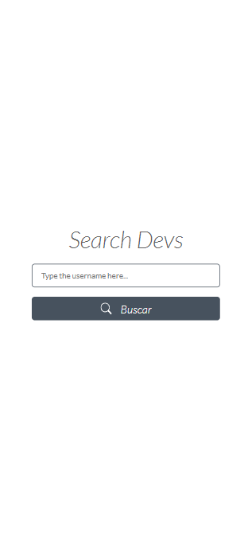
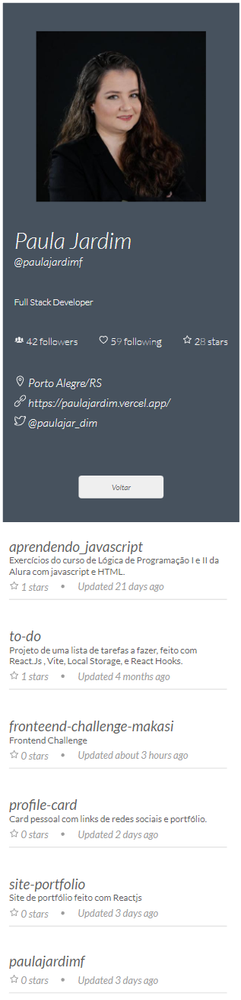

# Search Devs

Projeto desenvolvido para o teste da vaga de Desenvolvedor Front End na empresa Makasí.
O objetivo foi fazer um site totalmente responsivo que pesquisa na API do GitHub pelo username, retorna com as informações do usuário e os repositórios.

Funcionalidades:
- ``Homepage com um input e um botão para pesquisa;``
- ``ProfilePage com informações do usuário clicáveis, e repositórios ordenados por estrelas também clicáveis;``

# Índice

* [Tecnologias usadas](#tecnologias-usadas)
* [Imagem do projeto](#imagem-do-projeto)
* [Deploy](#deploy)
* [Rodando o Projeto](#rodando-o-projeto)

## Tecnologias usadas:

- ``React.js``
- ``Vite.js``
- ``axios``
- ``styled-omponents``
- ``react-router-dom``
- ``react-icons``
- ``react-spinners``

OBS: Utilizei o Vite.js pela levez e rapidez comparado ao CRA, styled-components para poder editar o layout nos mínimos detalhes e manter o CSS separado por componente. React-icons para os ícones do projeto, e react-spinners para os spinners de carregamento no botão de busca e da página ProfilePage enquanto é feita a requisição pela API.
## Imagem do projeto:

## Deploy:

- ``Vercel`` | Link: <https://fronteend-challenge-makasi-paulajardimf.vercel.app/>

## Rodando o projeto:
- Rode o console na pasta em que você baixou os arquivos;

- Insira o comando ``npm install``;

- Depois, o comando ``npm run dev`` para rodar no navegador.
